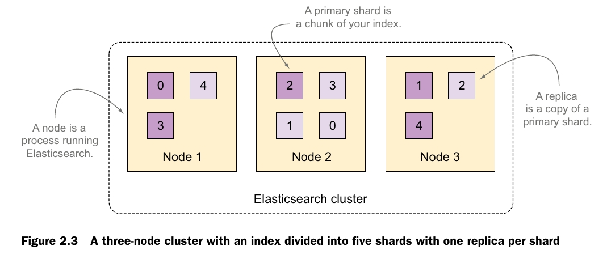

## TF-IDF

* Term frequency—The more times the words you’re looking for appear in a document, the higher the score.
* Inverse document frequency—The weight of each word is higher if the word is uncommon across other documents.

# 2 Diving into the functionality

## Understanding the logical layout: documents, types, and indices

### document

* It’s self-contained. A document contains both the fields (name) and their values (Elasticsearch Denver).
* It can be hierarchical. Think of this as documents within documents. A value of a field can be simple, like the value of the location field can be a string. It can also contain other fields and values. For example, the location field might contain both a city and a street address within it.
* It has a flexible structure. Your documents don’t depend on a predefined schema.  For example, not all events need description values, so that field can be omitted altogether. But it might require new fields, such as the latitude and longitude of the location.

### types

### indices

An Elasticsearch index is an independent chunk of documents, much like a database is in the relational world: each index is **stored on the disk** in the same set of files; it stores all the fields from all the mapping types in there, and it has its own settings. For example, each index has a setting called *refresh_interval*, which defines the interval at which newly indexed documents are made available for searches.

## Understanding the physical layout: nodes and shards

### Understanding primary and replica shards

 A shard is a Lucene index: a directory of files containing an inverted index. An inverted index is a structure that enables Elasticsearch to tell you which document contains a term (a word) without having to look at all the documents.

 > **Elasticsearch index vs. Lucene index**
 > An Elasticsearch index is broken down into chunks: shards. A shard is a Lucene index, so an Elasticsearch index is made up of multiple Lucene indices. This makes sense because Elasticsearch uses Apache Lucene as its core library to index your data and search through it.

